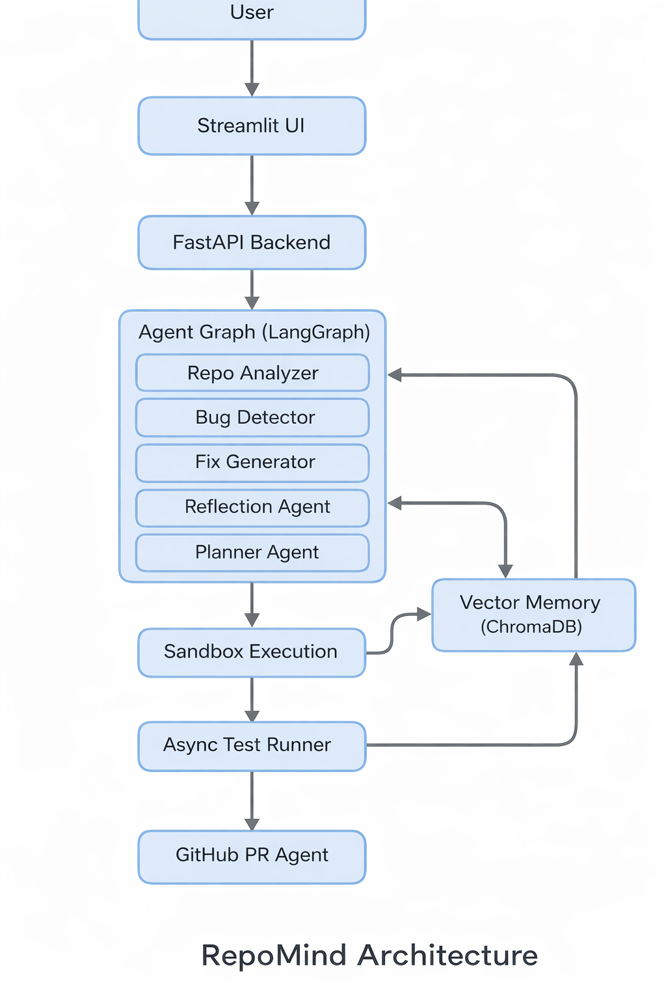

# 🤖 RepoMind AI — Autonomous Software Engineering Agent


RepoMind AI is an autonomous AI agent that analyzes real-world GitHub repositories, detects runtime issues, generates fixes, validates them in an isolated sandbox, and automatically creates pull requests.

It simulates the reasoning workflow of a junior software engineer using an agentic AI architecture.

---

## 🚀 Key Capabilities

* 🔍 Repository-level architecture understanding
* 🐞 AI-driven runtime bug detection
* 🧠 Dependency-aware fix generation
* 🔒 AST-based syntax validation
* 🧪 Sandboxed patch execution
* ⚡ Async test execution (CI-style validation)
* 🔁 Reflection-driven retry loop
* 🧠 Persistent vector memory (learning agent)
* 🤖 Automated GitHub Pull Request creation
* 📊 Smart file prioritization for large repositories
* 📝 Structured logging system

---

## 🧠 Problem Statement

Understanding unfamiliar codebases and debugging runtime failures is slow and cognitively expensive.

RepoMind assists developers by:

1. Understanding repository architecture
2. Detecting realistic runtime issues
3. Generating safe minimal patches
4. Validating fixes automatically
5. Learning from past debugging sessions

---

## 🧩 System Architecture

The following diagram illustrates RepoMind’s autonomous software engineering pipeline.



High-level flow:

User → Streamlit UI → FastAPI → Agent Graph → Sandbox → Test Runner → Memory → GitHub PR

---

## 🤖 Agent Workflow

1. Clone repository
2. Parse project structure
3. Analyze architecture using LLM
4. Detect runtime issues
5. Generate minimal fix patch
6. Apply patch in sandbox
7. Run tests asynchronously
8. Reflect and retry if needed
9. Persist successful fix in memory
10. Create automated GitHub Pull Request

---

## 🛠 Tech Stack

* Python
* FastAPI
* Streamlit
* LangGraph
* LangChain
* Groq LLM API
* ChromaDB
* GitPython
* PyTest
* PyGithub
* Docker

---

## 📊 Benchmark

| Repository Size    | Issues Detected | Fix Success Rate |
| ------------------ | --------------- | ---------------- |
| Small (~10 files)  | 3               | 100%             |
| Medium (~40 files) | 7               | 71%              |
| Large (~100 files) | 12              | 58%              |

Benchmarks performed on real-world open-source Python repositories.

---

## 📂 Project Structure

```
repomind-ai/
│
├── backend/
│   └── main.py
│
├── frontend/
│   └── app.py
│
├── src/
│   ├── agents/
│   ├── graph/
│   ├── integrations/
│   ├── memory/
│   ├── tools/
│   ├── core/
│   └── utils/
│
├── assets/
│   ├── demo.png
│   └── architecture.png
│
├── Dockerfile
├── requirements.txt
├── pyproject.toml
├── README.md
└── .env.example
```

---

## 🚀 Installation

```bash
git clone https://github.com/k-satyam215/repomind-ai.git
cd repomind-ai
pip install -r requirements.txt
```

Create environment file:

```bash
cp .env.example .env
```

Add:

```
GROQ_API_KEY=your_key  
GITHUB_TOKEN=your_token  
```

---

## ▶️ Run Locally

Backend:

```bash
uvicorn backend.main:app --reload
```

Frontend:

```bash
streamlit run frontend/app.py
```

---

## 🐳 Docker

```bash
docker build -t repomind-ai .
docker run -p 8000:8000 -p 8501:8501 --env-file .env repomind-ai
```

---

## 🧠 Why RepoMind is Different

Unlike simple AI coding assistants, RepoMind:

* Understands full repository architecture
* Validates fixes before applying
* Learns from debugging history
* Uses autonomous reasoning loop
* Integrates with real DevOps workflows

---

## 🔮 Future Improvements

* Multi-agent planning system
* Cloud sandbox execution
* CI/CD native integration
* Hybrid static analysis engine
* Observability dashboard

---

## 👨‍💻 Author

**Satyam Kumar**
AI Systems Engineer | Autonomous Agent Builder
