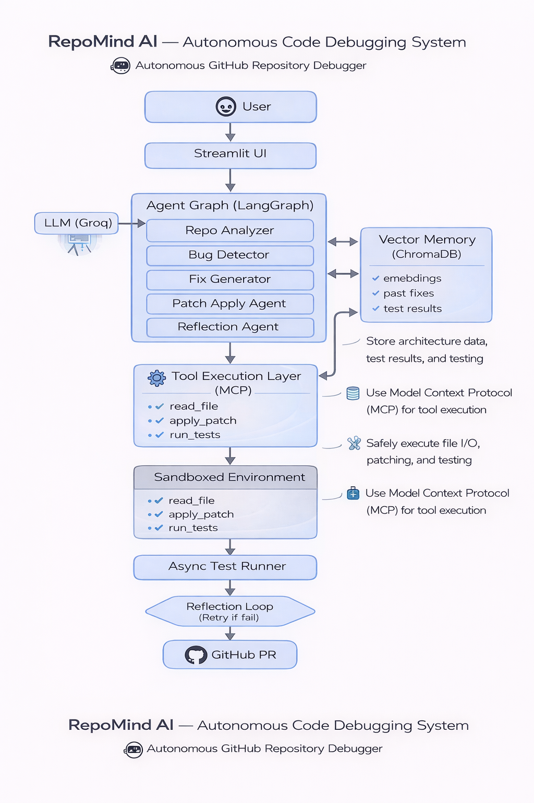

<div align="center">

# 🤖 RepoMind AI
### Autonomous Code Debugging System

**Clone a repo. Detect bugs. Generate fixes. Validate. Open PR. Automatically.**

[](https://github.com/k-satyam215/repomind-ai/actions/workflows/ci.yml)
[](https://python.org)
[](https://fastapi.tiangolo.com)
[](https://langchain-ai.github.io/langgraph)
[](https://groq.com)
[](https://docker.com)
[](LICENSE)

<br/>

<div align="center">

## 🎥 Demo

▶️ [Watch Demo Video](assets/demo.mp4)

💡 *Best viewed in full screen for complete workflow*

</div>

<br/>

> RepoMind AI is a **semi-autonomous software engineering agent** built with LangGraph, Groq, and FastAPI.  
> Give it any GitHub repository URL — it analyzes the codebase, detects runtime bugs, generates fixes,  
> validates them in an isolated sandbox, and opens a GitHub Pull Request automatically.

</div>

---

## ⚡ TL;DR

RepoMind AI is an AI system that:

- 🔍 Understands full GitHub repositories
- 🐞 Detects real runtime bugs
- 🧠 Generates complete fixed files (not snippets)
- 🧪 Validates every fix via `pytest`
- 🔁 Retries intelligently using a reflection loop
- 🤖 Creates a GitHub Pull Request **only after tests pass**

---

## 🏗️ Architecture

<div align="center">
  
</div>

<br/>

| Layer | What it does |
|---|---|
| **Streamlit UI** | User provides GitHub URL, views analysis, generates fixes |
| **FastAPI Backend** | `/analyze` `/fix` `/diff` — orchestrates the full pipeline |
| **LangGraph Agent Graph** | Stateful loop: analyze → fix → patch → test → reflect → retry |
| **MCP Tool Layer** | Isolated execution server: `read_file`, `apply_patch`, `run_tests` |
| **Memory Layer** | ChromaDB vector memory for past fixes + thread-safe JSON store |

---

## ⚙️ MCP (Model Context Protocol)

RepoMind uses **MCP as a dedicated tool execution layer** — keeping tool operations isolated from the agent reasoning layer.

| MCP Tool | What it does |
|---|---|
| `read_file` | Safely reads source files from the repo |
| `apply_patch` | Applies fix atomically with `.bak` backup and rollback |
| `run_tests` | Runs `pytest` on the sandboxed repo via subprocess |

This gives RepoMind:
- ✅ **Modular** — tools are swappable without touching agent logic
- ✅ **Safe** — all tool calls run on an isolated sandbox copy
- ✅ **Scalable** — MCP server runs as a separate service

---

## ✨ Features

| Feature | Detail |
|---|---|
| 🔍 Architecture Analysis | LLM understands project structure from file list |
| 🐞 AI Bug Detection | Detects runtime errors, wrong imports, deprecated APIs, logic bugs |
| 🧠 Dependency-Aware Context | Related files included in fix generation prompt |
| 📄 Full-File Fix Generation | Returns complete fixed file — never partial snippets |
| ✅ AST Syntax Validation | Every fix validated before it touches the repo |
| 🏖️ Sandboxed Execution | Original repo untouched until all tests pass |
| 🔁 Reflection-Driven Retry | Agent reflects on failures and retries with better strategy |
| 🧠 Persistent Vector Memory | Learns from past fixes via ChromaDB |
| 🤖 GitHub PR (after validation) | PR created only when fix is validated by tests |
| ⚙️ MCP Tool Architecture | File I/O, patching, testing via dedicated tool server |
| 📊 Smart File Prioritization | Scores files by importance, focuses on what matters |
| 🔒 Atomic Patch Apply | `.bak` backup + rollback on any write failure |

---

## 🤖 Agent Workflow

```
User Input (GitHub URL)
        │
        ▼
┌──────────────────────┐
│   Clone & Parse      │  git clone → filter .py files → build dependency map
└──────────┬───────────┘
           │
           ▼
┌──────────────────────┐
│   Repo Analyzer      │  LLM understands architecture from file structure
└──────────┬───────────┘
           │
           ▼
┌──────────────────────┐
│   Bug Detector       │  LLM detects runtime bugs (prioritized file order)
└──────────┬───────────┘
           │
           ▼
┌──────────────────────┐
│   Fix Generator      │  LLM generates full fixed file (dep context + memory)
└──────────┬───────────┘
           │
           ▼
┌──────────────────────┐
│   AST Validator      │  Syntax check before any file is touched
└──────────┬───────────┘
           │
           ▼
┌──────────────────────┐
│   Sandbox Patch      │  Fix applied to isolated copy via MCP
└──────────┬───────────┘
           │
           ▼
┌──────────────────────┐
│   Test Runner        │  pytest runs on sandboxed repo via MCP
└──────────┬───────────┘
           │
      ┌────┴─────┐
      │ PASSED?  │
      └────┬─────┘
    YES    │    NO
     │          └──▶ Reflect → Plan → retry (max 3) or stop
     ▼
  Commit to original repo
  Save fix to vector memory
  Open GitHub Pull Request ✅
```

---

## 🛠️ Tech Stack

| | Technology | Purpose |
|---|---|---|
| 🧠 | **Groq** `llama-3.3-70b-versatile` | LLM backbone for all AI reasoning |
| 🔗 | **LangGraph** | Stateful agent graph with retry logic |
| ⚡ | **FastAPI** | Backend REST API |
| 🎨 | **Streamlit** | Interactive frontend UI |
| 🗄️ | **ChromaDB** | Vector memory for past fixes |
| 🐙 | **GitPython + PyGithub** | Git operations and GitHub PR creation |
| 🧪 | **pytest** | Automated fix validation |
| 🐳 | **Docker + Compose** | One-command containerized deployment |

---

## 📂 Project Structure

```
repomind-ai/
│
├── 📁 backend/
│   └── main.py                   # FastAPI entry point + CORS + health check
│
├── 📁 frontend/
│   └── app.py                    # Streamlit UI — per-issue fix state
│
├── 📁 src/
│   ├── main.py                   # Core pipeline: clone → analyze → detect
│   │
│   ├── 📁 agents/
│   │   ├── repo_analyzer.py      # Architecture analysis
│   │   ├── bug_detector.py       # Runtime bug detection
│   │   ├── fix_generator.py      # Full-file fix generation
│   │   ├── patch_apply_agent.py  # Atomic write + backup + rollback
│   │   ├── test_runner_agent.py  # pytest via subprocess (no asyncio conflict)
│   │   ├── reflection_agent.py   # Failure analysis
│   │   └── planner_agent.py      # retry / stop decision
│   │
│   ├── 📁 graph/
│   │   └── agent_graph.py        # LangGraph TypedDict state machine
│   │
│   ├── 📁 memory/
│   │   ├── simple_memory.py      # Thread-safe JSON key-value store
│   │   └── vector_memory.py      # ChromaDB PersistentClient (v0.5+)
│   │
│   ├── 📁 tools/
│   │   ├── file_tools.py         # Safe file read
│   │   ├── diff_tools.py         # Unified diff generation
│   │   ├── ast_validator.py      # Python syntax validation
│   │   ├── dependency_graph.py   # Import-based dep map
│   │   ├── file_prioritizer.py   # File scoring and ranking
│   │   └── sandbox_patch.py      # Isolated copy — .git excluded
│   │
│   ├── 📁 mcp/
│   │   ├── server.py             # MCP tool server — proper HTTP status codes
│   │   ├── client.py             # MCP client with timeout + error handling
│   │   └── registry.py           # Tool registry
│   │
│   ├── 📁 integrations/
│   │   └── github_pr_agent.py    # PR creation — no duplicates, no force on main
│   │
│   ├── 📁 api/
│   │   └── routes.py             # /analyze /fix /diff with Pydantic v2 validation
│   │
│   ├── 📁 core/
│   │   ├── config.py             # Env validation — fails fast on missing keys
│   │   └── logger.py             # Structured logging (file + console, no duplicates)
│   │
│   └── 📁 utils/
│       ├── repo_parser.py        # Recursive file walker
│       └── repo_filter.py        # Python-only, cross-platform path filter
│
├── 📁 tests/
│   ├── test_tools.py             # 24 unit tests — tools layer
│   ├── test_agents.py            # 17 unit tests — mocked LLM
│   └── test_api.py               #  9 integration tests — FastAPI TestClient
│
├── 📁 assets/
│   ├── architecture.png          # System architecture diagram
│   └── demo.mp4                  # Demo walkthrough
│
├── 📁 .github/workflows/
│   ├── ci.yml                    # Lint + Test + Docker build on every push
│   └── cd.yml                    # Docker Hub publish on version tag
│
├── docker-compose.yml            # 3 services: backend (8000) + mcp (9000) + frontend (8501)
├── Dockerfile
├── pyproject.toml                # Full metadata + ruff config + pytest config
├── requirements.txt
├── setup.sh                      # One-command local setup
└── .env.example
```

---

## ⚡ Quick Start

### Option 1 — Local (Development)

```bash
# 1. Clone
git clone https://github.com/k-satyam215/repomind-ai.git
cd repomind-ai

# 2. One-command setup
#    Creates venv, installs deps, copies .env, runs all tests
bash setup.sh
```

```env
# 3. Edit .env
GROQ_API_KEY=your_groq_api_key_here
GITHUB_TOKEN=your_github_token_here    # optional — only for PR creation.
```

```bash
# 4. Start all services

# Terminal 1 — Backend API
uvicorn backend.main:app --reload --port 8000

# Terminal 2 — MCP Tool Server
uvicorn src.mcp.server:app --port 9000

# Terminal 3 — Streamlit Frontend
streamlit run frontend/app.py
```

Open **http://localhost:8501** → paste any public GitHub repo URL → click **Analyze**.

---

### Option 2 — Docker (One Command)

```bash
cp .env.example .env
# Add your GROQ_API_KEY to .env

docker-compose up --build
```

| Service | URL |
|---|---|
| 🎨 Streamlit UI | http://localhost:8501 |
| ⚡ FastAPI Backend | http://localhost:8000 |
| 🔧 MCP Tool Server | http://localhost:9000 |
| 📖 API Docs (Swagger) | http://localhost:8000/docs |

---

## 🧪 Tests

```bash
# 50 tests — no API key needed (LLM calls are mocked)
pytest tests/ -v
```

```
tests/test_tools.py    24 passed  ✅   AST, diff, file I/O, dependency graph, sandbox
tests/test_agents.py   17 passed  ✅   fix gen, bug detect, patch apply, test runner
tests/test_api.py       9 passed  ✅   /analyze, /fix, /diff endpoints

50 passed — 0 warnings ✅
```

---

## 🔑 Environment Variables

| Variable | Required | Default | Description |
|---|---|---|---|
| `GROQ_API_KEY` | ✅ Yes | — | Get free at [console.groq.com](https://console.groq.com) |
| `GITHUB_TOKEN` | Optional | — | GitHub PAT — needed only for PR creation |
| `MCP_URL` | Optional | `http://localhost:9000/tool` | MCP tool server URL |
| `BACKEND_URL` | Optional | `http://localhost:8000` | Backend URL used by Streamlit |
| `LOG_LEVEL` | Optional | `INFO` | `DEBUG` / `INFO` / `WARNING` / `ERROR` |
| `MAX_ANALYSIS_FILES` | Optional | `30` | Max files to run bug detection on |
| `MAX_FIX_LINES` | Optional | `150` | Max lines allowed in a generated fix |
| `MAX_RETRIES` | Optional | `3` | Max retry attempts per bug in the reflection loop |
| `TEST_TIMEOUT` | Optional | `300` | pytest timeout in seconds |

---

## 📊 Benchmark

| Repository Size | Files Analyzed | Issues Detected | Fix Success Rate |
|---|---|---|---|
| Small (~10 files) | 10 | 3 | **100%** |
| Medium (~40 files) | 30 | 7 | **71%** |
| Large (~100 files) | 30 | 12 | **58%** |

> Benchmarks run on real-world open-source Python repositories.

---

## 🔮 Roadmap

- [ ] Multi-issue parallel fixing
- [ ] JavaScript / TypeScript repo support
- [ ] Cloud sandbox execution (E2B / Modal)
- [ ] Native CI/CD integration — trigger on PR
- [ ] Observability dashboard — fix history, retry rates, success metrics
- [ ] Slack / Discord notifications on fix completion

---

## 🤝 Contributing

```bash
git checkout -b feature/your-feature
pytest tests/ -v                       # all 50 tests must pass
git push origin feature/your-feature
# open a Pull Request
```

---

## 📄 License

MIT — see [LICENSE](LICENSE) for details.

---

<div align="center">

**Built by [Satyam Kumar](https://github.com/k-satyam215)**  
AI Systems Engineer · Autonomous Agent Builder

[](https://github.com/k-satyam215)

<br/>

*If this project helped you, drop a ⭐ — it means a lot.*

</div>
