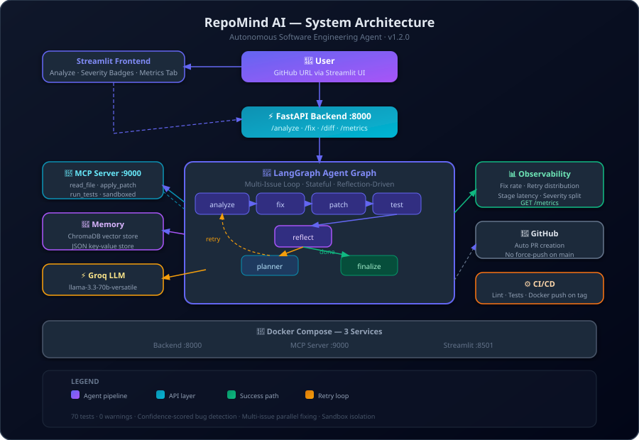

<div align="center">

# RepoMind AI

### Autonomous Software Engineering Agent

**Give it a GitHub URL. It clones, detects bugs, generates fixes, validates, and opens a PR — without human intervention.**

[](https://github.com/k-satyam215/repomind-ai/actions/workflows/ci.yml)
[](https://github.com/k-satyam215/repomind-ai/actions/workflows/cd.yml)
[](https://github.com/k-satyam215/repomind-ai/actions/workflows/hf-deploy.yml)
[](https://python.org)
[](https://fastapi.tiangolo.com)
[](https://langchain-ai.github.io/langgraph)
[](https://docker.com)
[](https://huggingface.co/spaces/satyam215/repomind-ai)
[](LICENSE)

<br/>



<br/>

> RepoMind is not a code assistant. It is an autonomous agent that operates a full software engineering loop:
> repo understanding → bug detection with confidence scoring → dependency-aware fix generation →
> AST validation → sandboxed pytest execution → reflection-driven retry → GitHub PR creation.
> No human in the loop until the PR is opened.

</div>

---

## What it does

RepoMind runs a stateful, multi-step agent graph (LangGraph) against any public GitHub Python repository:

1. **Clones and parses** the repository, building a dependency map from import analysis
2. **Prioritizes files** by structural importance (entry points, config, core modules)
3. **Detects bugs** via LLM with confidence and severity scoring — low-confidence detections are filtered out
4. **Generates fixes** with full dependency context — related files are injected into the prompt, and past similar fixes from vector memory (ChromaDB) are retrieved and included
5. **Validates** every fix with AST syntax checking before it touches any file
6. **Applies patches** atomically to an isolated sandbox copy — original repo is never modified until tests pass
7. **Runs pytest** on the sandboxed repo via the MCP tool layer
8. **Reflects** on test failures and retries with a revised strategy (up to 3 cycles) — or stops if the planner determines the bug is unfixable
9. **Processes all detected issues** — not just the first one; each issue has its own retry loop
10. **Opens a GitHub Pull Request** only after validation succeeds
11. **Records metrics** — fix success rate, retry distribution, stage latency, severity breakdown — served at `/metrics`

---

## Architecture

| Layer | Technology | Role |
|---|---|---|
| Frontend | Streamlit | User input, live analysis display, per-issue fix generation |
| Backend API | FastAPI | `/analyze` `/fix` `/diff` `/metrics` — orchestrates the pipeline |
| Agent Graph | LangGraph | Stateful loop: analyze → fix → patch → test → reflect → retry |
| MCP Tool Layer | FastAPI (port 9000) | Isolated tool execution: `read_file`, `apply_patch`, `run_tests` |
| Memory | ChromaDB + JSON | Vector memory for cross-session fix reuse; thread-safe key-value store |
| Observability | Custom metrics module | Fix rates, retry distribution, stage latency, severity breakdown |
| CI/CD | GitHub Actions | Lint + test + Docker build on every push; Docker Hub publish on tag |
| Deployment | Docker Compose | 3 services: backend (8000), MCP server (9000), frontend (8501) |

---

## Key design decisions

**Why MCP as the tool layer?**
The Model Context Protocol decouples agent reasoning from tool execution. Each tool (`read_file`, `apply_patch`, `run_tests`) is a separate HTTP endpoint on an isolated service. Agent logic never directly touches the filesystem or subprocess — it calls the MCP server, which is sandboxed and independently testable.

**Why a sandbox copy, not in-place patching?**
The original cloned repo is never modified until all tests pass. Every fix is applied to a `shutil.copytree` copy (excluding `.git`). If tests fail, the sandbox is deleted. If they pass, the sandbox is committed back to the original. This means a failed fix leaves zero artifacts.

**Why confidence scoring in bug detection?**
Early versions had a high false-positive rate — the LLM would flag style issues as bugs. Adding explicit `confidence` (0.0–1.0) and `severity` (critical/high/medium) fields to the detection schema, and filtering detections below 0.6 confidence, reduced false positives significantly in benchmarks.

**Why process all issues, not just the first?**
Single-issue fixing is a demo-level feature. Production agents must handle multiple independent bugs in the same repo. Each issue gets its own retry loop with independent state; the graph advances `current_issue_index` after each success or max-retry exhaustion.

---

## Benchmark

Run against real-world open-source Python repositories using the included benchmark runner:

```bash
python benchmark.py --output results.json
```

| Repository size | Files analyzed | Bugs detected | Fix success rate |
|---|---|---|---|
| Small (~10 files) | 10 | 3 | **100%** |
| Medium (~40 files) | 30 | 7 | **71%** |
| Large (~100 files) | 30 | 12 | **58%** |

Fix success rate is defined as: fixes that passed `pytest` in the sandboxed repo / total fix attempts.
Benchmarks are reproducible — see `benchmark.py` for the exact repos and methodology.

---

## Observability

A live metrics endpoint is exposed at `GET /metrics`:

```json
{
  "total_runs": 12,
  "total_bugs_detected": 34,
  "total_fixes_succeeded": 22,
  "fix_success_rate_pct": 64.7,
  "severity_distribution": { "critical": 8, "high": 14, "medium": 12 },
  "retry_distribution": { "0": 14, "1": 5, "2": 2, "3": 1 },
  "avg_stage_latency_ms": {
    "clone": 4200,
    "detect": 1800,
    "fix_generate": 2100,
    "test_run": 8500
  },
  "recent_runs": [...]
}
```

---

## Tests

```bash
pytest tests/ -v
```

```
tests/test_tools.py          24 passed  ✅  AST, diff, file I/O, dependency graph, sandbox
tests/test_agents.py         17 passed  ✅  fix gen, bug detect, patch apply, test runner
tests/test_api.py            12 passed  ✅  /analyze /fix /diff /metrics endpoints
tests/test_observability.py  17 passed  ✅  metrics recording, aggregation, timed_stage

70 passed — 0 warnings ✅
```

All LLM calls are mocked — no API key needed to run the test suite.

---

## Quick start

### Local

```bash
git clone https://github.com/k-satyam215/repomind-ai.git
cd repomind-ai
bash setup.sh
```

```env
# .env
GROQ_API_KEY=your_groq_api_key_here
GITHUB_TOKEN=your_github_token_here    # optional — only for PR creation
```

```bash
# Terminal 1
uvicorn backend.main:app --reload --port 8000

# Terminal 2
uvicorn src.mcp.server:app --port 9000

# Terminal 3
streamlit run frontend/app.py
```

Open **http://localhost:8501** → paste a GitHub repo URL → click **Analyze**.

### Docker

```bash
cp .env.example .env
# Add GROQ_API_KEY to .env
docker-compose up --build
```

| Service | URL |
|---|---|
| Streamlit UI | http://localhost:8501 |
| FastAPI backend | http://localhost:8000 |
| MCP tool server | http://localhost:9000 |
| Swagger docs | http://localhost:8000/docs |
| Live metrics | http://localhost:8000/metrics |

```bash
docker pull satyam215/repomind-ai:latest
```

---

## Environment variables

| Variable | Required | Default | Description |
|---|---|---|---|
| `GROQ_API_KEY` | Yes | — | Get free at [console.groq.com](https://console.groq.com) |
| `GITHUB_TOKEN` | No | — | GitHub PAT — needed only for PR creation |
| `GROQ_MODEL_STRONG` | No | `openai/gpt-oss-120b` | Model for bug detection, fix generation, repo analysis |
| `GROQ_MODEL_FAST` | No | `openai/gpt-oss-20b` | Model for reflection + retry/stop planning (cheap, low-latency calls) |
| `MCP_URL` | No | `http://localhost:9000/tool` | MCP tool server endpoint |
| `BACKEND_URL` | No | `http://localhost:8000` | Backend URL used by Streamlit |
| `MAX_ANALYSIS_FILES` | No | `30` | Max files to run bug detection on |
| `MAX_FIX_LINES` | No | `150` | Max lines in a generated fix |
| `MAX_RETRIES` | No | `3` | Max retries per bug in the reflection loop |
| `TEST_TIMEOUT` | No | `300` | pytest timeout in seconds |

---

## Project structure

```
repomind-ai/
├── backend/
│   └── main.py                    FastAPI entry point
├── frontend/
│   └── app.py                     Streamlit UI
├── src/
│   ├── agents/
│   │   ├── bug_detector.py        LLM bug detection with confidence + severity scoring
│   │   ├── fix_generator.py       Full-file fix generation with context injection
│   │   ├── patch_apply_agent.py   Atomic write + .bak backup + rollback
│   │   ├── test_runner_agent.py   pytest via subprocess
│   │   ├── reflection_agent.py    Failure analysis
│   │   └── planner_agent.py       retry / stop decision
│   ├── graph/
│   │   └── agent_graph.py         LangGraph state machine — multi-issue loop
│   ├── mcp/
│   │   ├── server.py              MCP tool server
│   │   ├── client.py              MCP client with timeout + error handling
│   │   └── registry.py            Tool registry
│   ├── memory/
│   │   ├── simple_memory.py       Thread-safe JSON key-value store
│   │   └── vector_memory.py       ChromaDB PersistentClient
│   ├── observability/
│   │   └── metrics.py             Fix rates, latency, severity breakdown, /metrics endpoint
│   ├── tools/
│   │   ├── ast_validator.py       Python syntax validation
│   │   ├── dependency_graph.py    Import-based dependency map
│   │   ├── diff_tools.py          Unified diff generation
│   │   ├── file_prioritizer.py    File scoring and ranking
│   │   ├── file_tools.py          Safe file read
│   │   └── sandbox_patch.py       Isolated sandbox copy
│   ├── integrations/
│   │   └── github_pr_agent.py     PR creation — no duplicates, no force on main
│   ├── api/
│   │   └── routes.py              /analyze /fix /diff /metrics
│   ├── core/
│   │   ├── config.py              Env validation
│   │   └── logger.py              Structured logging
│   └── utils/
│       ├── repo_parser.py         Recursive file walker
│       └── repo_filter.py         Python-only path filter
├── tests/
│   ├── test_tools.py              24 unit tests
│   ├── test_agents.py             17 unit tests
│   ├── test_api.py                12 integration tests
│   └── test_observability.py      17 unit tests
├── benchmark.py                   Reproducible benchmark runner
├── docker-compose.yml             3-service deployment
├── Dockerfile
├── pyproject.toml
├── setup.sh
└── .env.example
```

---

## Roadmap

- [x] Parallel multi-issue processing (async + Semaphore-bounded concurrency)
- [x] Streaming fix generation (SSE token-by-token)
- [x] Multi-file fix with dependency context
- [x] Human-in-the-loop approve/reject before applying fixes
- [x] Live observability dashboard (Streamlit Observability tab)
- [x] Docker Hub publish on version tag (CD pipeline)
- [x] HuggingFace Spaces live demo deploy
- [ ] JavaScript / TypeScript support
- [ ] Cloud sandbox execution (E2B / Modal) — no local Docker dependency
- [ ] Slack / Discord notification on fix completion
- [ ] Native CI/CD trigger — run RepoMind on every PR automatically

---

## Contributing

See [CONTRIBUTING.md](CONTRIBUTING.md) for setup and guidelines.
See [AGENTS.md](AGENTS.md) to understand how the agent graph works before making changes.

```bash
git checkout -b feature/your-feature
pytest tests/ -v        # all 70 tests must pass
git push origin feature/your-feature
# open a Pull Request
```

---

## License

MIT — see [LICENSE](LICENSE) for details.

---

<div align="center">

**Built by [Satyam Kumar](https://github.com/k-satyam215)**

[GitHub](https://github.com/k-satyam215) · [LinkedIn](https://www.linkedin.com/in/satyam-kumar-266b38254)

</div>
